# NAGAI YOSHITAKA ポートフォリオサイト<!-- omit in toc -->
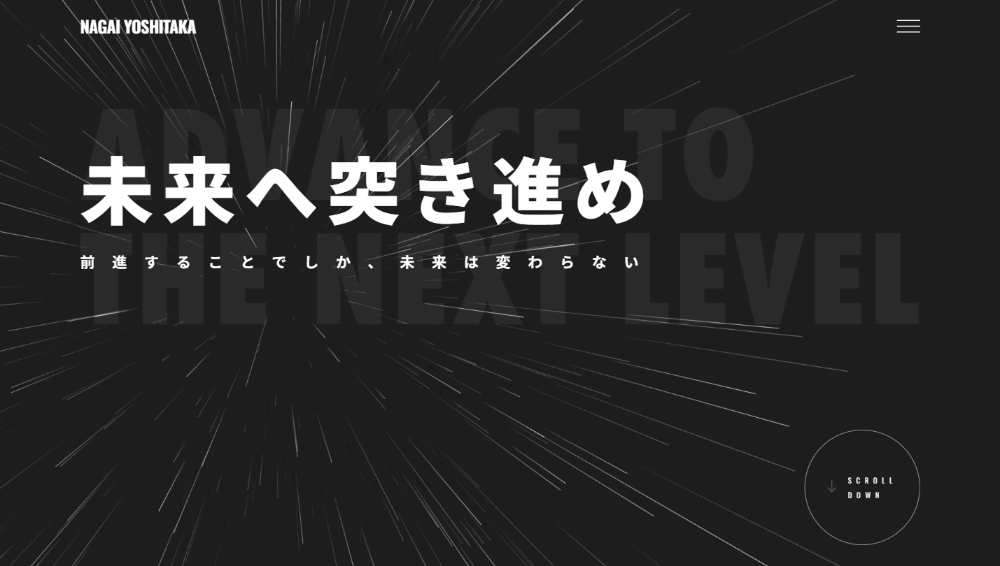

## 目次<!-- omit in toc -->
- [概要](#概要)
- [公開URL](#公開url)
- [目的](#目的)
- [こだわったポイント](#こだわったポイント)
- [使用技術](#使用技術)
- [使用フォント](#使用フォント)
- [デザインカンプ](#デザインカンプ)
- [各画面・機能紹介](#各画面機能紹介)
  - [トップページ](#トップページ)
    - [MVセクション](#mvセクション)
      - [Three.jsによる背景描画アニメーション](#threejsによる背景描画アニメーション)
    - [MESSAGEセクション](#messageセクション)
    - [ABOUTセクション](#aboutセクション)
      - [ACFを用いたプロフィール情報の動的化](#acfを用いたプロフィール情報の動的化)
    - [SKILLセクション](#skillセクション)
      - [ACFを用いたスキル情報の動的化](#acfを用いたスキル情報の動的化)
      - [SVGパス描画アニメーション](#svgパス描画アニメーション)
    - [WORKSセクション](#worksセクション)
      - [ACFを用いた柔軟なコンテンツ管理設計](#acfを用いた柔軟なコンテンツ管理設計)
      - [GSAP（ScrollTrigger）を使用したスクロール連動UI](#gsapscrolltriggerを使用したスクロール連動ui)
    - [CONTACTセクション](#contactセクション)
  - [作品一覧ページ](#作品一覧ページ)
    - [ACFを用いた柔軟な作品一覧出力](#acfを用いた柔軟な作品一覧出力)
    - [カスタムタクソノミーとJSを連動させたフィルター機能](#カスタムタクソノミーとjsを連動させたフィルター機能)
  - [作品詳細ページ](#作品詳細ページ)
    - [ACFを用いた作品情報の動的化](#acfを用いた作品情報の動的化)
    - [カスタムスクロールバー](#カスタムスクロールバー)
    - [GSAPとStickyを用いた画像エリアの横スクロール対応](#gsapとstickyを用いた画像エリアの横スクロール対応)
  - [お問い合わせページ](#お問い合わせページ)
  - [Thanksページ](#thanksページ)
- [WordPressプラグイン使用による実装](#wordpressプラグイン使用による実装)
  - [Custom Post Type UI (CPT UI)](#custom-post-type-ui-cpt-ui)
  - [Advanced Custom Fields (ACF)](#advanced-custom-fields-acf)
  - [SEO SIMPLE PACK](#seo-simple-pack)
  - [SiteGuard WP Plugin \& WP Mail SMTP](#siteguard-wp-plugin--wp-mail-smtp)
  - [Contact Form 7](#contact-form-7)
    - [デフォルト機能の無効化と独自スタイルの適用](#デフォルト機能の無効化と独自スタイルの適用)
    - [JavaScriptによる安全でシームレスな送信処理](#javascriptによる安全でシームレスな送信処理)

## 概要
本サイトは、コーダー・フロントエンドエンジニアとしてのスキルやこれまでの制作実績をまとめた個人のポートフォリオサイトです。

今後の継続的な作品追加を想定し、WordPressのオリジナルテーマとしてゼロから構築しました。管理画面から直感的に作品の追加・編集を行えるよう、運用面を考慮した設計にしています。

## 公開URL
[https://portfolio.mikanbako.jp/](https://portfolio.mikanbako.jp/)

## 目的
これまでの制作実績をわかりやすく伝えるとともに、本サイト自体を「WordPressのオリジナルテーマ構築」という一つの作品として提示するため。

画面のUIデザインやフロントエンドの実装から、継続的な管理・運用を見据えたCMS環境の構築まで、現在の自身の総合的なスキルセットを可視化することを目的に制作しました。

## こだわったポイント
* **GSAPを活用した滑らかなスクロールアニメーション**

  GSAPとScrollTriggerを用いて、スクロールに連動した心地よいアニメーションを実装しました。背景の一部にはThree.jsによる描画をアクセントとして取り入れ、シンプルながらも視線を惹きつけるリッチな表現を目指しました。

* **スクロール連動によるコンテンツ表示**

  トップページの作品紹介エリアでは、ScrollTriggerのPin（固定）機能を活用しています。スクロール操作だけで次々と作品が切り替わるUIを実装し、ユーザーがスムーズに実績を閲覧できる心地よい体験にこだわりました。

* **細部までデザインを調和させたUI設計**

  詳細ページの作品画像エリアにはカスタムスクロールバーを実装し、ブラウザ標準のデザインではなく、サイトの雰囲気に馴染むよう細部まで調整しています。また、横長の作品は横スクロールで対応するなど、快適に作品を閲覧できる設計を心掛けました。

* **カスタム投稿とACFを駆使した「運用しやすい」CMS設計**

  更新作業の負担を減らすため、カスタム投稿タイプとACF（Advanced Custom Fields）を活用しています。トップページでの表示切替や一覧ページでの表示順、スキルタグ（カスタムタクソノミー）による絞り込み機能など、管理画面から柔軟に作品を管理できる仕組みを構築しました。

* **実務を想定したインフラ構築とデプロイ体制**

  さくらVPS（Ubuntu / Apache）を用いて、サーバー環境をゼロから構築しました。さらにGitと連携し、リモートリポジトリの変更を `git pull` で本番環境へスムーズに反映できるデプロイ体制を整えるなど、保守・運用面も実務を意識した環境構築を行っています。

## 使用技術
**フロントエンド**
* GSAP
* Three.js (MV～MESSAGEセクションでの背景描画に使用)
* JavaScript
* Sass (SCSS)
* HTML

**バックエンド**
* WordPress
* PHP

**データベース**
* MySQL

**インフラ・その他**
* さくらVPS
* Apache (Webサーバー)
* Git / GitHub (バージョン管理・デプロイ)

## 使用フォント
* 和文フォント

  [Noto Sans JP](https://fonts.google.com/noto/specimen/Noto+Sans+JP)

* 欧文フォント

  [Oswald](https://fonts.google.com/specimen/Oswald)

## デザインカンプ
[Figmaページ](https://www.figma.com/design/oxv9pQ7REeRA8bIJeLAS96/%E3%83%9D%E3%83%BC%E3%83%88%E3%83%95%E3%82%A9%E3%83%AA%E3%82%AA%E3%82%B5%E3%82%A4%E3%83%88?node-id=0-1&t=BzG1GcLpfhDDp16S-1)（Figmaページへのリンクです。閲覧のみ可能です。）

※上記はベースとなったデザインカンプです。アニメーションの追加や細かなUI・レイアウトの調整は実装段階でコードを書きながらブラッシュアップを行ったため、現在の実際のサイトとは一部デザインが異なる箇所がございます。

## 各画面・機能紹介

本サイトの主要なページ構成と、各画面に実装している機能やこだわりポイントについて、実際の動き（webp動画）やスクリーンショットを交えながら紹介します。

### トップページ

これまでの実績と現在のスキルを要約して伝えるメインページです。閲覧者が最後まで飽きずにスクロールできるよう、GSAPによるアニメーションを取り入れ、視覚的に楽しめる工夫をページ全体に施しています。

>関連ファイル: [front-page.php](wp-content/themes/portfolio-theme/front-page.php)

#### MVセクション
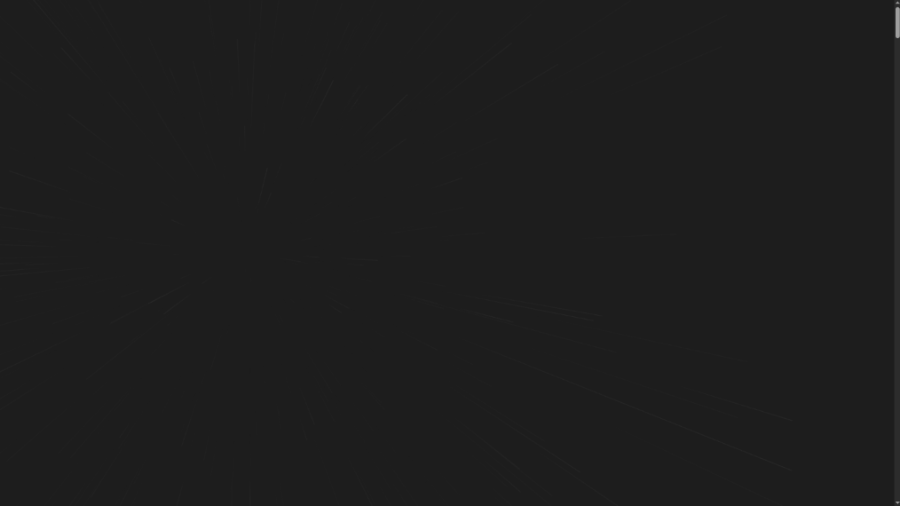

ポートフォリオの顔となるメインビジュアルです。静的なデザインだけでなく、Webならではの動的な表現を取り入れるため、タイポグラフィに後述するThree.jsの動的な背景アニメーションを組み合わせることで、訪問者の目を惹きつけるデザインに仕上げました。

>関連ファイル: [top-mv.js](wp-content/themes/portfolio-theme/js/top-mv.js)

##### Three.jsによる背景描画アニメーション
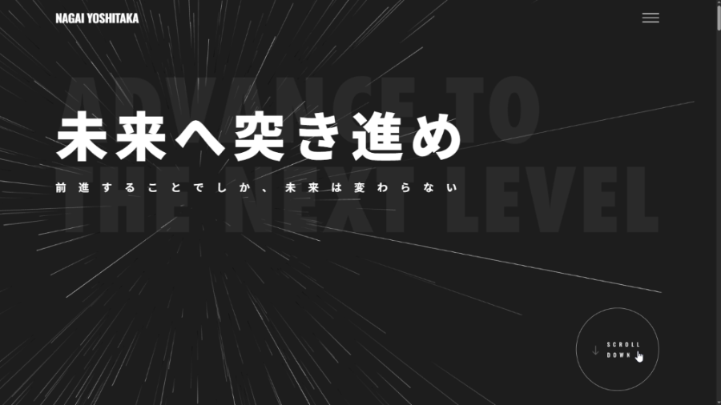

背景のアニメーションは、Three.jsを用いて描画しています。単に動かすだけでなくGSAPのScrollTriggerと連携させ、MVから次のMESSAGEセクションへスクロールする動きに連動して、パーティクルの動きやカメラの視点がシームレスに変化する演出を実装しました。

>関連ファイル: [top-bg.js](wp-content/themes/portfolio-theme/js/top-bg.js)

#### MESSAGEセクション
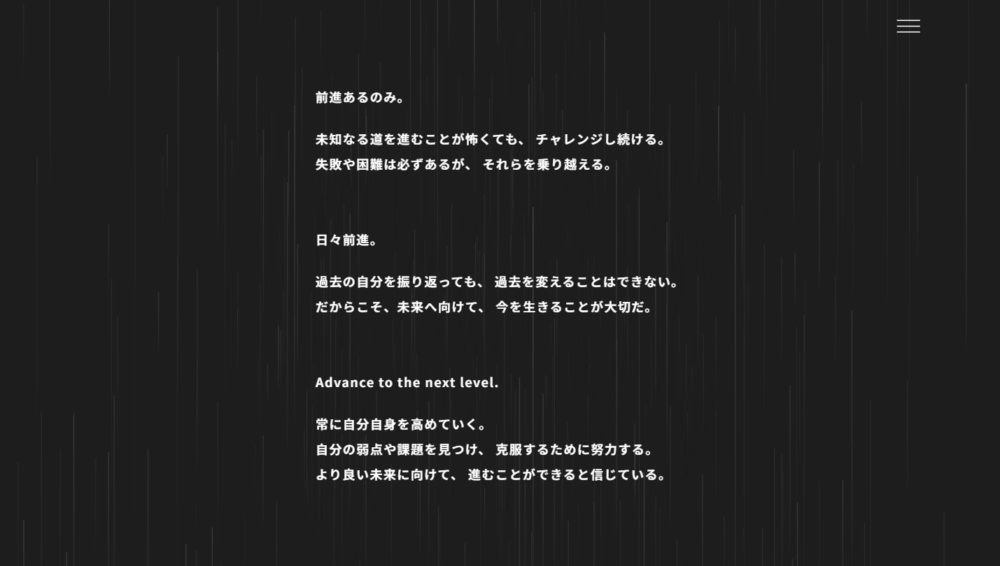

MVセクションからスクロールで滑らかに繋がる、自身の想いを綴ったセクションです。背景アニメーションの余韻を残しつつも、テキストがしっかり読まれるようシンプルなレイアウトを心掛けました。

#### ABOUTセクション
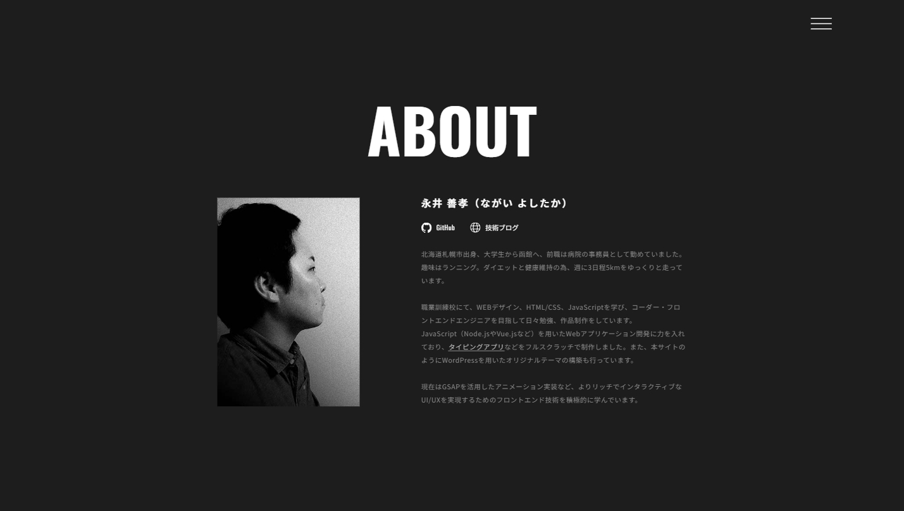

自身のプロフィールや経歴を紹介するセクションです。常に最新の情報を発信できるよう、保守性を意識した設計を行っています。

##### ACFを用いたプロフィール情報の動的化
コードを直接編集することなく自己紹介を更新できるよう、以下の項目をWordPressの管理画面から編集・管理できる仕組みを構築しました。

* プロフィール画像
* 名前
* 各種リンク（GitHub、ブログなど）
* 自己紹介テキスト

#### SKILLセクション
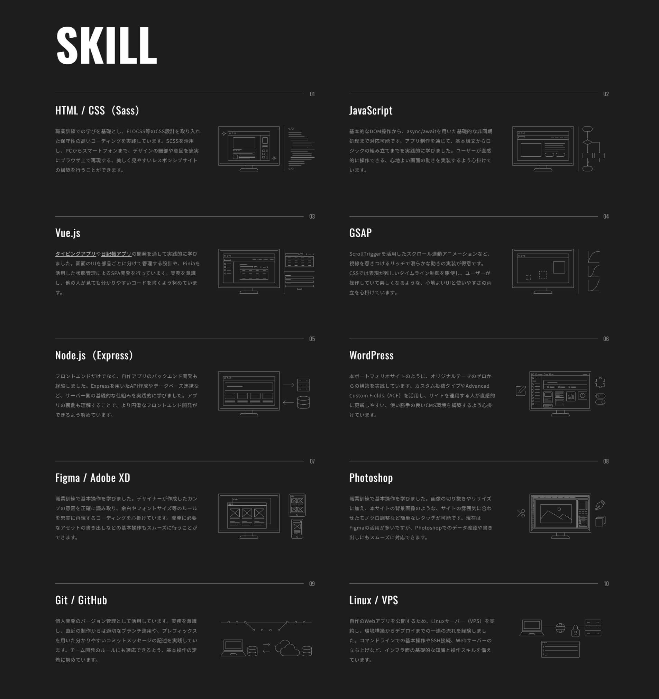

自身の現在のスキルセットや扱える技術について、具体的な経験やアピールポイントをまとめたセクションです。

##### ACFを用いたスキル情報の動的化
今後、習得した新しい技術やツールが増えた際にも柔軟に対応できるよう、以下の情報をWordPressの管理画面から編集・管理できる仕組みを構築しました。
* スキル名
* アイコン画像（SVGファイル）
* テキスト（スキルの経験や強みなどの詳細説明）

##### SVGパス描画アニメーション

各スキルのアイコンには、SVGの `path` 要素を活用した描画アニメーションを実装しています。SVGパスの全長を取得した上で、 `stroke-dasharray` と `stroke-dashoffset` プロパティの数値をコントロール（オフセット値をパスの全長から0へと変化）させることで、線が滑らかに描かれていく、視覚的に心地よい演出にこだわりました。

>関連ファイル: [top-skill.js](wp-content/themes/portfolio-theme/js/top-skill.js)

#### WORKSセクション
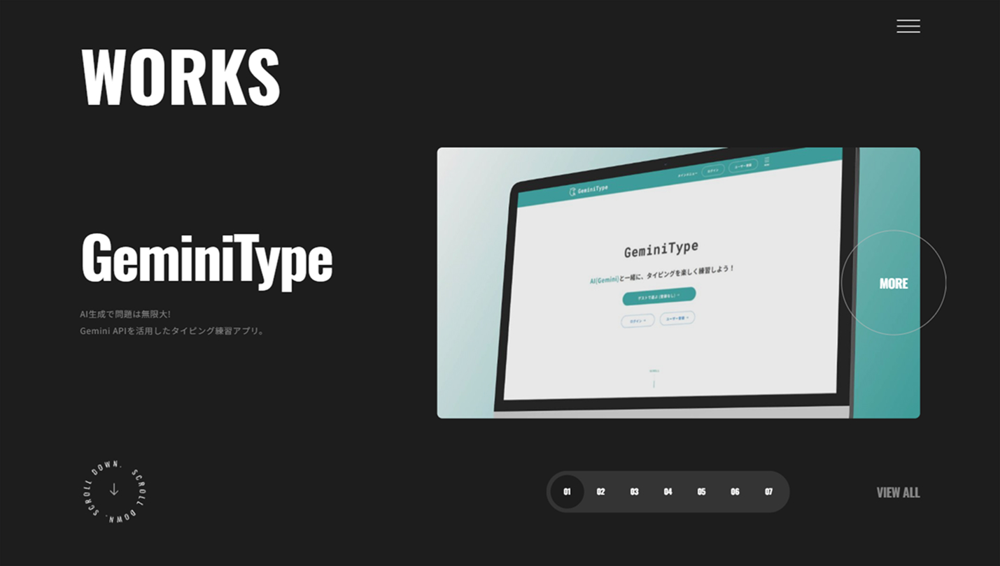

トップページのメインコンテンツとなる、制作実績を紹介するセクションです。WordPressによる柔軟なデータ管理と、JavaScriptを用いたリッチなフロントエンドの実装を掛け合わせた、本サイトにおける最大のこだわりポイントです。

##### ACFを用いた柔軟なコンテンツ管理設計

運用面を考慮し、トップページに表示する作品をWordPressの管理画面からコントロールできる仕組みを構築しました。

具体的には、ACFで作成した「トップページに表示する」のチェックボックス（`show_on_top`）と、「トップ表示順」（`top_order`）の数値を基準に、`WP_Query` を用いて最大7件までの作品データを取得・出力しています。

これにより、ソースコードを編集することなく「今一番見せたい実績」だけを自由に入れ替えられる、実務の運用要件を想定したCMS設計を実現しています。

##### GSAP（ScrollTrigger）を使用したスクロール連動UI

管理画面にて選んだ作品（7作品）を、ユーザーに閲覧してもらえるよう、GSAPのScrollTriggerを用いてエリア全体をピン留め（固定）する実装を行っています。

スクロールの進行度に応じて、各作品のタイトルや画像がシームレスに切り替わるアニメーションを作成しました。

また、ページネーションのクリックによる滑らかなスクロール移動や、移動方向に応じたインジケーターのアニメーション、スクロール速度に連動して回転が加速するサークルテキストなど、細部の動きもこだわって実装しています。

>関連ファイル: [top-works.js](wp-content/themes/portfolio-theme/js/top-works.js)

#### CONTACTセクション
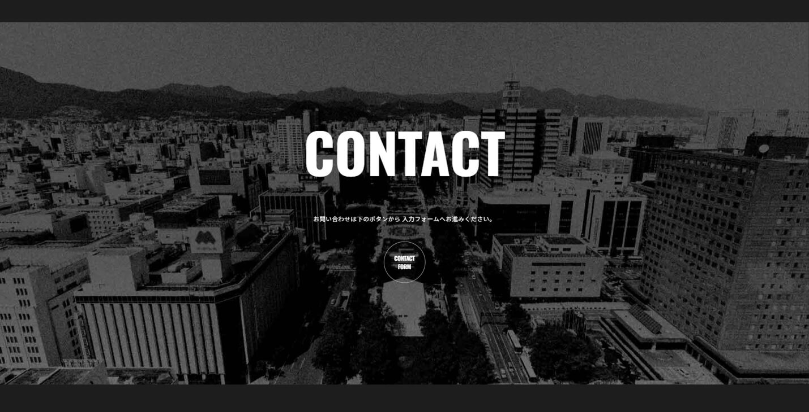

トップページの最後を締めくくるセクションです。お問い合わせページへの導線として機能しており、サイトを最後まで閲覧したユーザーを迷わせることなく、スムーズに入力フォームへ誘導できるシンプルな構成にしています。

### 作品一覧ページ
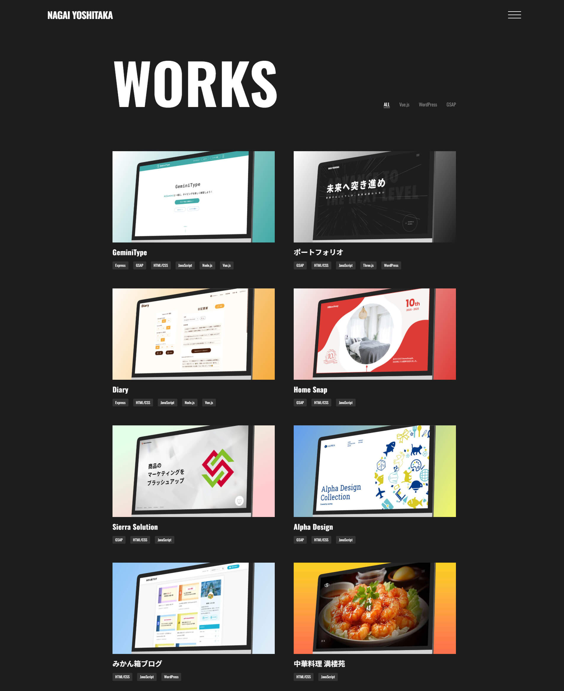

これまでの制作実績を一覧で閲覧できるアーカイブページです。ユーザーが目的の作品へ素早くアクセスできるよう、シンプルなカード型レイアウトと絞り込み（フィルター）機能を実装しています。

>関連ファイル: [archive-works.php](wp-content/themes/portfolio-theme/archive-works.php)

#### ACFを用いた柔軟な作品一覧出力
運用者が「どの作品を上部に表示するか」をコントロールできるよう、ACFで作成した「一覧表示順（`list_order`）」の数値を基準に、`WP_Query` を用いて自動ソート（降順）を行って出力しています。作品のサムネイルやタイトル、使用技術のタグなどもWordPress側から動的に生成され、管理画面での更新が即座にページへ反映される保守性の高い設計です。

#### カスタムタクソノミーとJSを連動させたフィルター機能
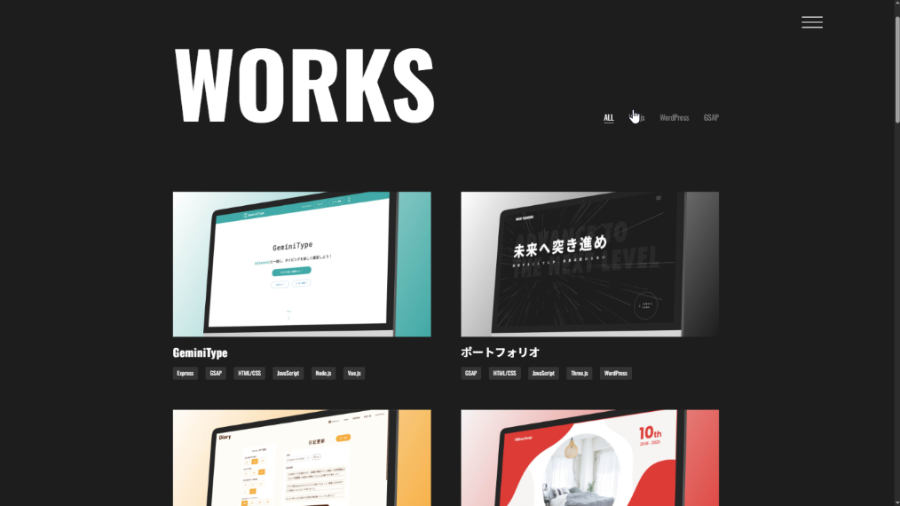

画面遷移（リロード）を伴わないスムーズなユーザー体験を提供するため、JavaScriptによる即時の絞り込み（フィルター）機能を実装しています。

WordPressのループ出力時に、各作品が持つ使用技術（タクソノミー）のスラッグを取得し、HTMLのカスタムデータ属性（`data-skills`）として付与しています。フロント側では、クリックされたフィルターボタンのデータ属性（`data-filter`）と作品のデータ属性をJavaScriptで照合し、CSSクラスの付け外しを行うことで、高速かつシームレスなフィルター機能を実現しました。

>関連ファイル: [works-filter.js](wp-content/themes/portfolio-theme/js/works-filter.js)

### 作品詳細ページ
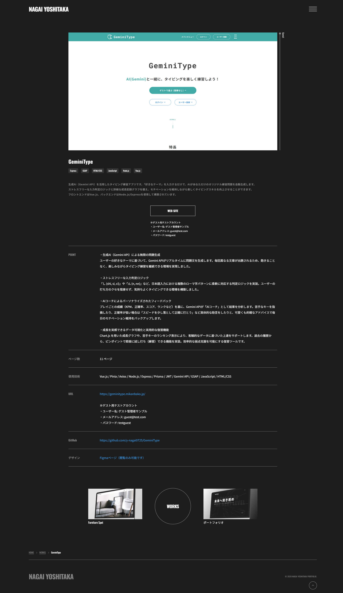

選択した作品の概要や使用技術、こだわりポイントなどを紹介する個別ページです。ページ下部には、一覧ページ同様にACFの「表示順（`list_order`）」を基準にした「前の作品」「次の作品」へのナビゲーションを実装し、回遊性を高めています。

>関連ファイル: [single-works.php](wp-content/themes/portfolio-theme/single-works.php)

#### ACFを用いた作品情報の動的化
概要、使用技術、こだわりポイント、各種URL（GitHubやFigmaなど）といった多岐にわたる作品情報を、すべてACFを用いて管理画面から入力できる仕組みを構築しています。

これにより、作品ごとに異なる情報の粒度にも柔軟に対応でき、一貫性のあるデザインフォーマットのまま簡単に実績を追加・更新することが可能です。

#### カスタムスクロールバー
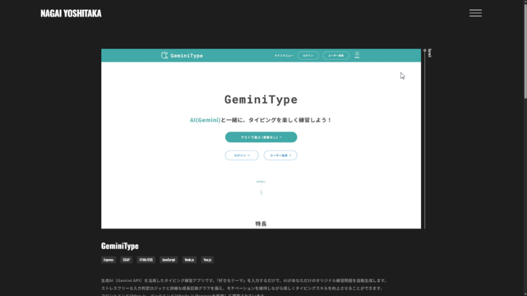
サイト全体のデザインを保つため、作品画像を表示するエリアにはブラウザ標準のスクロールバーではなく、独自に実装したカスタムスクロールバーを採用しています。

JavaScriptを用いて、マウスやタッチでのドラッグ操作はもちろん、スクロールエリア自体のスクロール量とも同期するよう計算し、ネイティブに近い操作性を実現しました。

>関連ファイル: [works-single.js](wp-content/themes/portfolio-theme/js/works-single.js)

#### GSAPとStickyを用いた画像エリアの横スクロール対応
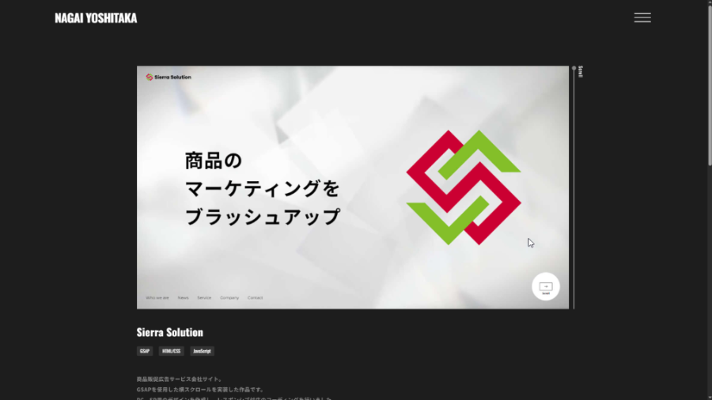

横スクロール作品の画像を閲覧できるように、縦スクロールに連動して画像が横へスライドする専用の仕組みを実装しています。

ここではGSAP（ScrollTrigger）の標準的なPin留め機能はあえて使用していません。Pin留めとカスタムスクロールバーが干渉して起こるガタつきを防ぐため、CSSの `position: sticky` と、JSによるダミーの余白の動的生成を組み合わせるアプローチを採用しました。これにより、スクロールバーの動きと画像の横スライドが同期する、滑らかで心地よいUIを実現しています。

>関連ファイル: [works-single-horizontal.js](wp-content/themes/portfolio-theme/js/works-single-horizontal.js)

### お問い合わせページ
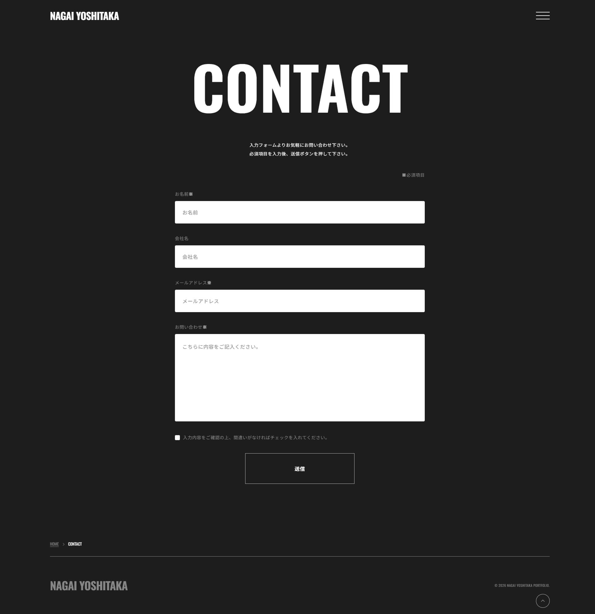

サイト訪問者からのご連絡を受け付けるためのコンタクトフォームです。

ユーザーが迷わず入力できるよう、必要最低限の項目でシンプルかつ分かりやすいUIにしています。

フォームの送信処理やサンクスページへの画面遷移などのシステム的な実装については、後述の「[Contact Form 7](#contact-form-7)」の項目にて詳しく解説します。

>関連ファイル: [page-contact.php](wp-content/themes/portfolio-theme/page-contact.php)

### Thanksページ
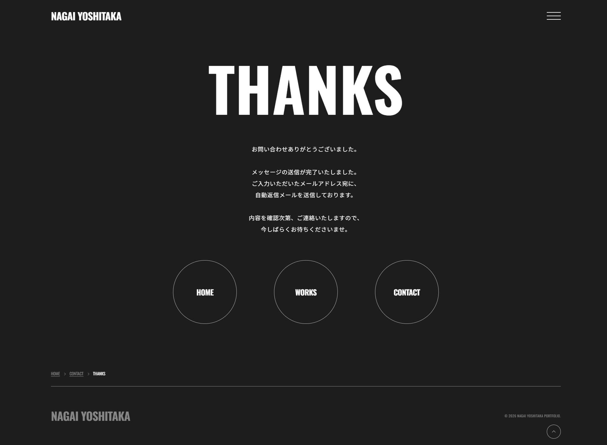

お問い合わせフォームの送信完了後に遷移するサンクスページです。

送信完了のメッセージや自動返信メールに関するご案内を表示するとともに、HOME（トップページ）やWORKS（作品一覧ページ）などの主要ページへ戻るためのリンクを配置し、ユーザーが送信後も迷わずサイト内を回遊できるようにしています。

>関連ファイル: [page-thanks.php](wp-content/themes/portfolio-theme/page-thanks.php)

## WordPressプラグイン使用による実装
本サイトのCMS環境を構築するにあたり、実務での運用を想定したプラグイン選定を行っています。

不要なデフォルト機能は [`functions.php`](wp-content/themes/portfolio-theme/functions.php) で制御・停止させるなど、パフォーマンスと保守性を両立させるためのカスタマイズを施しました。

>関連ファイル: [functions.php](wp-content/themes/portfolio-theme/functions.php)

### Custom Post Type UI (CPT UI)
ポートフォリオのメインコンテンツとなる「Works（作品）」専用のカスタム投稿タイプを作成するために使用しています。

標準の投稿機能とは切り離し、後述する[ACF（Advanced Custom Fields）](#advanced-custom-fields-acf)と組み合わせることで、作品管理に特化した使いやすい入力画面を実現しました。

### Advanced Custom Fields (ACF)
本サイトの柔軟な運用を支えるコア機能として活用しています。

作品詳細ページの多様な情報（概要や使用技術、Figma・GitHubへのリンク等）や、トップページのプロフィール・スキル情報を管理画面から入力・更新できるように実装しています。

また、単なるテキストの入力だけでなく、「トップページへの表示可否」や「一覧ページの表示順序」といった設定項目を用意し、テーマ側のPHP（`WP_Query`）と連携させることで、運用側の意図通りにサイトの表示を動的にコントロールできる仕組みを構築しました。

### SEO SIMPLE PACK
ページごとの `title` や `description`、OGP画像などのメタデータを管理するために導入しました。

各作品の魅力が正しく伝わるよう、最適なSEO設定やSNSシェア時の見え方（OGP）を管理画面から個別に調整できる環境を整えています。

### SiteGuard WP Plugin & WP Mail SMTP
実務レベルの運用・セキュリティ対策として導入しています。

SiteGuardによるログインURLの変更や画像認証で不正アクセスを防止するとともに、お問い合わせフォームのメール送信をWordPress標準機能から「WP Mail SMTP」経由（GmailのSMTPサーバーを利用）に切り替えることで、スパム判定リスクを抑えた確実なメール送信環境を実現しました。

### Contact Form 7
お問い合わせフォームの実装に使用しています。

本サイトではプラグインをそのまま導入するのではなく、サイトのデザインやユーザー体験を損なわないよう、フロントエンドの技術を駆使して徹底的なカスタマイズを行っています。

#### デフォルト機能の無効化と独自スタイルの適用
Contact Form 7のデフォルト設定で出力される不要なCSSの読み込みや、自動整形機能（`
` タグや` ` タグの自動挿入）を、[`functions.php`](wp-content/themes/portfolio-theme/functions.php) のフックを用いて完全に無効化しています。

これによりHTML構造を意図した通りにクリーンに保ち、サイトに合わせたオリジナルデザインをCSSで一から当て直しました。

独自デザインのカスタムチェックボックス、ローディングアニメーション（スピナー）のCSSによる自作など、細部のUIにまでこだわって実装しています。

>関連ファイル: [functions.php](wp-content/themes/portfolio-theme/functions.php) / [_contact.scss](wp-content/themes/portfolio-theme/scss/object/project/_contact.scss)

#### JavaScriptによる安全でシームレスな送信処理
フォーム送信時のユーザビリティと安全性を高めるため、JavaScriptで独自のイベント処理を組み込んでいます。

送信ボタンのクリック時にボタンの操作を無効化（`pointer-events: none`）し、システム不具合に繋がる二重送信を防止する対策を行っています。

また、入力エラーやスパム判定、サーバーエラーなどが発生して送信が中断された際には、即座にボタンを復活させて再入力を促す処理を実装しました。

無事に送信が成功（`wpcf7mailsent`イベント）した際には、WordPress側から渡したURLデータを用いて、Thanksページへシームレスにリダイレクトさせる処理を実装しています。

>関連ファイル: [contact.js](wp-content/themes/portfolio-theme/js/contact.js)